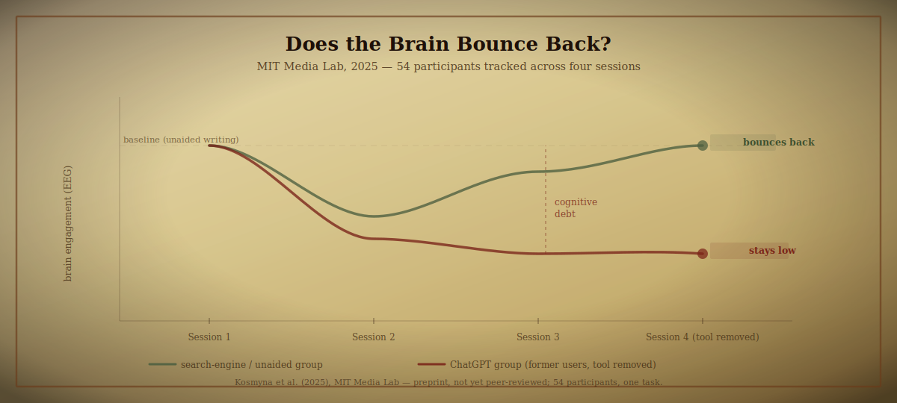
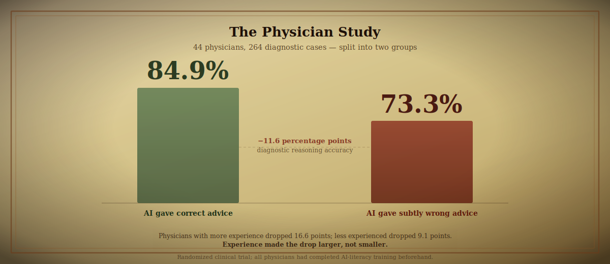
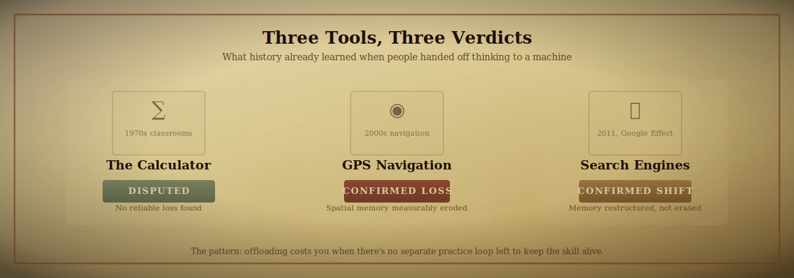
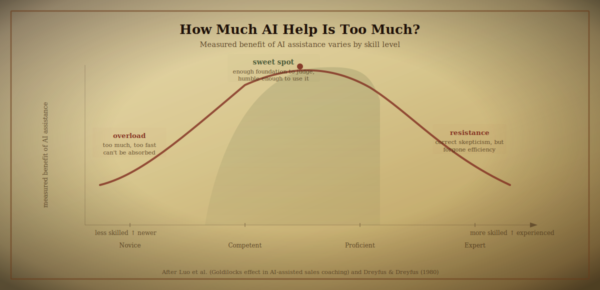
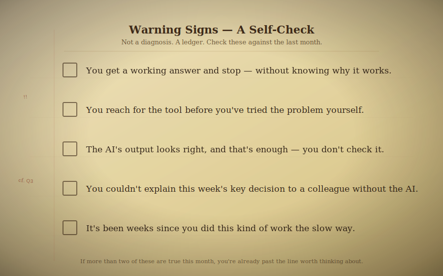

 

> [!NOTE]
> *In Plato's Phaedrus, Theuth offers the gift of writing to King Thamus, promising it will make people wiser. Thamus refuses the compliment: those who learn to write, he warns, will stop exercising memory, trusting instead in marks made by another hand — they will seem wise without being wise.*
>
> *Thamus was half right. Writing did erode a certain kind of memory. He was wrong that this made it worth refusing. The real question was never whether to use the tool — it was which parts of the mind to hand over, and which to keep.*

 

Every tool that thinks for you leaves an entry in two columns. One column is what you gained — time, ease, output. The other is what you quietly stopped practicing.

Most of the time nobody reads the second column until the balance is already due. This repository is a plain-language audit of that second column, built from peer-reviewed studies, randomized trials, and pre-registered research published between 2011 and 2026.

Where the evidence is strong, it says so. Where it's thin, contested, or still a preprint, it says that too.

---

## Table of Contents

1. [Am I actually getting worse at thinking, or does it just feel that way?](#1-am-i-actually-getting-worse-at-thinking-or-does-it-just-feel-that-way)
2. [If I stopped using AI tomorrow, would I bounce back — or is some of this permanent?](#2-if-i-stopped-using-ai-tomorrow-would-i-bounce-back--or-is-some-of-this-permanent)
3. [Do I actually understand what I just shipped, or did I just approve something that looked right?](#3-do-i-actually-understand-what-i-just-shipped-or-did-i-just-approve-something-that-looked-right)
4. [Isn't this the same panic people had about calculators and Google? Could I be wrong to worry?](#4-isnt-this-the-same-panic-people-had-about-calculators-and-google-could-i-be-wrong-to-worry)
5. [I'm already good at this — can I still lose it, or does experience protect me?](#5-im-already-good-at-this--can-i-still-lose-it-or-does-experience-protect-me)
6. [Where's the actual line — how much AI help is fine, and when does it tip over?](#6-wheres-the-actual-line--how-much-ai-help-is-fine-and-when-does-it-tip-over)
7. [Is there a real fix, or just vague advice like "use it in moderation"?](#7-is-there-a-real-fix-or-just-vague-advice-like-use-it-in-moderation)
8. [How would I even know if I'm already in trouble?](#8-how-would-i-even-know-if-im-already-in-trouble)
9. [Full Bibliography](#full-bibliography)

---

## 1. Am I actually getting worse at thinking, or does it just feel that way?

> [!IMPORTANT]
> **Short answer:** There's real evidence of a correlation, and a plausible mechanism behind it. But none of the studies can tell you whether *you specifically* are affected — only that the pattern is widespread enough to take seriously.

A 2025 study (Gerlich, published in *Societies*) asked 666 people, across every age and education level, how much they leaned on AI — then tested their critical thinking directly. Heavier AI use correlated with lower critical thinking performance. The connection wasn't incidental: the thing that was statistically driving the decline was the offloading itself, not just some background factor that happened to correlate with both. Younger participants were hit harder. More education acted as a partial buffer.

> [!WARNING]
> **The honest limit:** This is a survey, not a controlled experiment. It shows a strong association, not proof that AI *caused* the decline in any individual. People who already think less critically may be more drawn to leaning on AI. Treat this as evidence the pattern is widespread, not as proof of a one-way arrow.

The mechanism is well understood even if the causal direction isn't fully settled. Making a learning task *slightly harder* — forcing retrieval from memory instead of handing over the answer — produces stronger, longer-lasting learning than making it easy. Cognitive psychologist Robert Bjork documented this and called it *desirable difficulty*. An answer that arrives instantly, with no struggle, tends to be forgotten faster than one you had to work for. That's why an AI that hands over a finished answer can quietly cost you the retention you thought you were getting.

There's also what researchers call *metacognitive laziness*: the habit of asking yourself "wait, does this actually make sense?" quietly switches off when a tool appears to have already done the checking. The problem isn't that you got a wrong answer. It's that the *habit of asking whether it's right* stops firing.

So — is it real, or does it just feel that way? It's real enough that three separate research groups found it independently, using different methods and populations. That's not proof of catastrophe. It's proof worth paying attention to.

---

## 2. If I stopped using AI tomorrow, would I bounce back — or is some of this permanent?

> [!IMPORTANT]
> **Short answer:** For most people, most skills, probably yes — you'd bounce back with practice. But one study found a group whose brain engagement didn't return to baseline after the tool was removed, and that finding is hard to dismiss.

MIT's Media Lab tested this directly. Researchers took 54 participants (Kosmyna et al., 2025 — still a preprint, not yet peer-reviewed) and split them into three groups: one wrote essays using ChatGPT, one used a search engine, one used nothing. Brain activity was tracked with EEG across three sessions.

Then came the key move: in a fourth session, they swapped some groups around. Former ChatGPT users had to write unaided.

Their brain engagement did not simply bounce back to normal. The effect lingered. The researchers named this **cognitive debt** — a residue left behind after the tool is removed, not just reduced performance while it's in use. The ChatGPT group also remembered less of their own writing and felt less ownership over it.

 

> [!WARNING]
> **The honest limit:** 54 participants, one task, one model. Don't generalize the specific magnitude to all AI use or all tasks. The important thing isn't "permanent" vs "not permanent" — it's that the effect outlasted the tool's presence, which wasn't what most people expected.

Here's what we can say with more confidence: the brain reallocates resources away from circuits it doesn't use. This is a well-established property of neuroplasticity, not a metaphor. Physical skills fade without practice for the same reason. Mental ones work the same way.

So "would I bounce back" depends on what you do after you stop. If you stop using AI and also stop doing the underlying work, nothing recovers. If you stop and deliberately practice — in the same domain, with real effort — you'd likely rebuild. How fast, and whether all of it returns, nobody's actually measured in a good study yet.

The more practical version of your question: you probably haven't done anything irreversible. But "reversible" and "effortless to reverse" are different things.

---

## 3. Do I actually understand what I just shipped, or did I just approve something that looked right?

> [!IMPORTANT]
> **Short answer:** Probably less than you think. The most alarming evidence here isn't about students — it's a randomized trial where working professionals, *with AI-literacy training*, still got fooled by plausible-looking wrong answers.

Researchers took 44 physicians and split them into two groups. Both groups worked through 264 diagnostic cases. One group was given AI suggestions that were correct. The other group was given AI suggestions with deliberately planted errors.

The error group scored 14 percentage points lower on diagnostic reasoning — 84.9% accuracy vs. 73.3%. All of the physicians had completed AI-literacy training beforehand. It made no measurable difference.

 

There's something specific worth naming here: as AI gets more fluent, its wrong answers look just as polished as its right ones. The "just verify it" advice sounds sensible, but it assumes you can tell the difference between a correct suggestion and a clever-sounding incorrect one. In many technical domains, you can't — at least not without the very expertise that's at risk of atrophying. Call this the verification-loop problem.

The same dynamic shows up in software. Anthropic ran a randomized controlled trial (Shen & Tamkin, 2026) with 52 professional or freelance developers. Half learned a genuinely new Python library with AI assistance; half without. The AI-assisted group scored roughly 17 percentage points lower on the follow-up quiz. That's close to two letter grades. The largest gap was in debugging — exactly the skill you need most when something breaks in production.

A junior developer using AI assistance might ship working code on the first try and file it as "done" rather than "understood." Weeks later, when a related bug appears in production — in code that looks almost identical — they stare at it with no idea where to start. The comprehension gap only appears later, when something breaks.

> [!WARNING]
> The AI group in the Anthropic study was not meaningfully faster overall. Some participants spent up to a third of their time just composing prompts. The time savings people expect often don't show up in the data.

---

## 4. Isn't this the same panic people had about calculators and Google? Could I be wrong to worry?

> [!IMPORTANT]
> **Short answer:** Yes, you could be wrong — and the case for offloading thinking to tools is real and shouldn't be waved away. But the historical record is split, and the split matters.

Before any alarm: writing itself is a cognitive offloading tool. So are calculators, GPS, and this document. Plato's Thamus was wrong to refuse writing. The people who worried that search engines would destroy human knowledge were mostly wrong too. The pattern of "new tool → moral panic about cognitive decline" is old and has a bad track record.

The honest case for offloading is this: specialization works. No one memorizes the periodic table and also builds bridges from scratch. Tools let people operate at a higher level by delegating the low-level retrieval. The brain has limited bandwidth, and freeing some of it up for higher-order reasoning isn't obviously bad — it might be good. Extended cognition (Clark & Chalmers, 1998) describes the mind as legitimately including the tools it consistently uses. Your phone's contacts list is, in a functional sense, part of your memory. That's not a degradation; it's an extension.

 

Here's what the historical record actually shows. The calculator was, on balance, fine — large classroom studies going back decades found *no significant difference* in basic arithmetic ability between students who used calculators and those who didn't. The likely reason: arithmetic kept being taught and tested by hand regardless of the tool. The skill stayed practiced.

GPS navigation was not fine. A study from University College London recruited 50 regular drivers, measured lifetime GPS usage, then tested everyone on wayfinding *without* GPS. Heavier lifetime users performed measurably worse at building mental maps of unfamiliar space. A follow-up suggested the relationship runs in the direction of GPS *causing* the decline.

Search engines landed somewhere in between. Sparrow et al. (2011) found people didn't necessarily remember *less* — but they shifted what they remembered: toward *where* to find a fact rather than the fact itself. Memory restructured, not erased.

> [!NOTE]
> The pattern across all three: the calculator replaced a mechanical skill that was still separately practiced elsewhere. GPS and search replaced something with no separate practice loop left — once the tool existed, nobody made you rebuild a mental map or hold a fact in memory anyway. That's the question worth asking about your AI use: is the underlying skill still being practiced anywhere else in your week?

So: you could be wrong to worry. You're not crazy to worry. The honest answer is that it depends on whether there's any practice loop left once the tool takes over.

---

## 5. I'm already good at this — can I still lose it, or does experience protect me?

> [!IMPORTANT]
> **Short answer:** Experience slows the decline and raises the bar for how much reliance is risky. It does not make you immune. In fact, the one study that directly tested this found that *more* experience meant a *bigger* drop in accuracy.

Back to the physician study from question 3. The most counterintuitive finding wasn't the overall accuracy gap — it was what happened when the researchers broke down results by years of experience. Physicians with *more* years of experience showed a *bigger* drop in diagnostic accuracy when given subtly wrong AI suggestions: 16.6 percentage points vs. 9.1 percentage points for less experienced physicians.

Why? The leading hypothesis is that experienced clinicians have stronger pre-existing patterns of thought, which makes a plausible-but-wrong AI suggestion harder to override — it fits too neatly into established expectations. Less experienced physicians, having less anchored to prior judgment, scrutinized the AI output more carefully.

The Microsoft Research and Carnegie Mellon study (Lee et al., 2025, CHI 2025) found something complementary with 319 working professionals who used generative AI weekly. Two patterns emerged. The more confidence someone had *in the AI tool itself*, the less critical thinking they applied. The more confidence someone had *in their own ability*, the more they scrutinized the output. Expertise helped — but only if it translated into *active scrutiny*, not just the passive fact of being experienced.

> [!WARNING]
> **The key gap:** Most rigorous studies were specifically designed around *learning something new*, not maintaining something already mastered. Whether genuine expertise erodes over longer timeframes of heavy AI use — nobody's tested that directly yet. The physician data is the closest thing we have.

A senior practitioner who treats AI as a fast typist for decisions she's already made gets faster on most days. The failure mode isn't a lack of skill. It's a good week making her stop checking. Automation bias — the more a tool proves reliable, the less you double-check it — was documented in aviation research decades before generative AI existed. Pilots using autopilot systems became less vigilant monitors of the aircraft, not because they were careless, but because trusting an automated system is itself a cognitive habit that reduces active checking.

"I'm already good at this" is not evidence of immunity. It's evidence you haven't tested the assumption recently.

---

## 6. Where's the actual line — how much AI help is fine, and when does it tip over?

> [!IMPORTANT]
> **Short answer:** The line is different depending on your skill level, and the riskiest zone isn't where you'd expect — it's not novices or experts, it's the middle.

Researchers introduced AI-generated coaching feedback to sales teams of varying experience levels and measured subsequent performance. Novices, given fast and complex AI feedback, were overloaded — performance actually *dropped*, because they lacked the foundation to make sense of what the tool was telling them. Experts largely ignored the tool, partly out of distrust, partly because it threatened their professional identity. Mid-level performers improved the most. They had enough foundation to evaluate the feedback and enough humility to actually use it.

 

This is the Goldilocks effect: AI assistance has shown the clearest measured benefit in the middle of the skill ladder.

A counterweight to the bad news: Lira et al. (2025, University of Pennsylvania) had participants practice writing cover letters — one group with AI-generated examples to learn from, the other unaided. Researchers removed the AI entirely and retested everyone a day later. The AI-assisted group *kept their advantage*. The gains were still measurable with the AI gone.

The deciding factor wasn't the technology. It was how the practice was structured. Participants were shown examples to *learn from*, not handed a finished product to submit. That distinction is everything.

So here's the line, as specifically as the evidence allows:

- **Delegation without understanding** — handing the task over entirely, accepting what comes back without interrogating it — is where the cost accumulates, at every skill level.
- **Structured engagement** — using AI output as material to interrogate, compare against your own attempt, or explain back — appears to preserve or build skill.
- **Your skill level determines your buffer.** If you're still building the fundamentals, even "good" AI use carries higher risk of creating gaps you won't notice. If you're experienced, the risk is different: not that you won't learn, but that you'll stop checking.

---

## 7. Is there a real fix, or just vague advice like "use it in moderation"?

> [!IMPORTANT]
> **Short answer:** There are specific, tested behaviors that preserve skill — not just "be more mindful." The Anthropic study mapped six interaction patterns, three of which consistently protected learning outcomes.

Shen & Tamkin (2026) didn't just measure whether people used AI — they watched *how* 52 developers used it across a full learning task and identified six recognizable patterns. Three preserved learning. Three didn't.

 

**The three that preserved learning:**

1. **Ask "how does this work?" before "do this for me."** Use AI as a teacher, not a hand. Build understanding before code exists.
2. **Accept a draft, then interrogate it.** "Explain this line by line." "What could go wrong here?" The output becomes a lesson, not an escape.
3. **Attempt the problem yourself first, then compare.** The gap between your attempt and the AI's answer is where the learning lives.

**The three that didn't:**

4. **Full delegation.** "Just do it" — the task ships, nothing about the task is retained. Fastest in the moment, most costly the next time the problem reappears.
5. **Unverified acceptance.** The output looks plausible, so it ships without a check against real understanding. This is where confidence in the tool quietly replaces confidence in yourself.
6. **Prompt-only iteration.** Rephrasing the request over and over rather than reasoning about the problem. Effort goes into wording, not into the thinking the wording was meant to trigger.

Some adjacent evidence on what else actually helps:

A randomized trial in K–12 science classrooms found that AI tutors designed to *ask guiding questions*, rather than hand over answers, produced measurably better reasoning outcomes. This directly supports building "explain your reasoning" or "ask me a question first" into how you prompt.

Wang & Zhang (2026) found that mentally framing AI as a *collaborator you scrutinize* — rather than an oracle you accept — changed behavior measurably. People who adopted that framing became simultaneously more critical of AI output *and* more willing to delegate strategically. People who treated it as a passive tool did neither.

> [!NOTE]
> Two things that are plausible but not yet directly tested: dedicated AI-free blocks of deep work, and journaling your AI use afterward. Both are reasonable extensions of what we know about skill retention. Neither has been studied directly in this context. Sensible practices — not proven interventions.

---

## 8. How would I even know if I'm already in trouble?

> [!IMPORTANT]
> **Short answer:** The main signal is a gap between *feeling like you understand* and *being able to reconstruct* — and a pattern of never testing that gap.

These are reflection prompts, not a validated psychological instrument. Use them the way you'd use a ledger: an honest, private accounting, revisited occasionally.

 

The checklist above names the five patterns that show up most clearly in the research. Here's the reasoning behind each.

**You get a working answer and stop — without knowing *why* it works.** This is the Journeyman's failure mode from the Anthropic study. The code works. It gets filed as "done," not "understood." The comprehension gap only shows up later, when something breaks.

**You reach for the tool before you've tried the problem yourself.** The struggle before finding an answer is part of what makes the answer stick. Skipping it doesn't just skip the discomfort — it skips the retention.

**The AI's output looks right, and that's enough.** This is the verification-loop problem from question 3. Fluent wrong answers look the same as fluent right answers. "Looks right" is not the same as "is right," and the habit of checking the difference can go quiet without you noticing.

**You couldn't explain this week's key decision to a colleague without the AI.** If you accepted a suggestion you can't reconstruct or defend, you didn't really make that decision — you approved it. These are different things with different consequences when the decision turns out to be wrong.

**It's been weeks since you did this kind of work the slow way.** A senior professional who always has the tool available may not realize how long it's been since she solved this type of problem unaided. That's the "reliable tool reduces vigilance" pattern. A good week with the tool is evidence you weren't caught out, not evidence you're still sharp without it.

### For the student still building a skill:
- After using AI to understand something, could you re-explain it right now, closed-book, in your own words?
- Did you struggle with this at all before asking, or did you go straight to the tool?

### For someone early in applying a skill:
- When the AI's answer worked, do you know *why* it worked — could you have predicted the failure mode if it hadn't?
- If this exact tool were unavailable tomorrow, could you still complete today's task, more slowly but correctly?

### For someone already skilled:
- In the last week, was there a moment you accepted an AI suggestion faster than you would have a colleague's, purely because it had been reliable lately?
- When did you last deliberately do this task the slow way, just to check your own edge hasn't dulled?

> [!NOTE]
> One thing this document intentionally leaves out: creativity. A lot of people claim AI is making people less creative, and it's a reasonable worry. But none of the studies in this bibliography tested that directly, and the ones that touch on it are too confounded to draw clean conclusions. It's left out of the harder claims on purpose — not because it's unimportant.

---

## Full Bibliography

- Bjork, R. A. — foundational work on *desirable difficulties* in learning.
- Clark, A., & Chalmers, D. (1998). *The Extended Mind.* Analysis, 58(1).
- Dreyfus, S. E., & Dreyfus, H. L. (1980). *A Five-Stage Model of the Mental Activities Involved in Directed Skill Acquisition.*
- Gerlich, M. (2025). *AI Tools in Society: Impacts on Cognitive Offloading and the Future of Critical Thinking.* Societies, 15(1), 6.
- Khan, K. (2025). *Automated but Atrophied? Student Over-Reliance vs Expert Augmentation of AI in Learning and Cybersecurity.*
- Kosmyna, N., et al. (2025). *Your Brain on ChatGPT: Accumulation of Cognitive Debt when Using an AI Assistant for Essay Writing Task.* MIT Media Lab (preprint).
- Lee, H. H., et al. (2025). *The Impact of Generative AI on Critical Thinking: Self-Reported Reductions in Cognitive Effort and Confidence Effects From a Survey of Knowledge Workers.* CHI 2025 / Microsoft Research.
- Lira, B., et al. (2025). University of Pennsylvania study on durability of AI-assisted skill practice in a writing task.
- Luo, X., et al. Sales-coaching study documenting the "Goldilocks effect" of AI feedback across experience levels.
- Meuwese, R. et al. / UCL study on habitual GPS use and spatial memory. *Scientific Reports* (2020).
- Plato. *Phaedrus* — the myth of Theuth and Thamus.
- Physician randomized clinical trial on AI-assisted diagnostic reasoning: 44 physicians, 264 cases, AI-literacy training, 14-point accuracy gap between correct-AI and error-AI groups, with larger drops in more experienced physicians.
- Shen, J. H., & Tamkin, A. (2026). *How AI Impacts Skill Formation.* Anthropic.
- Sparrow, B., Liu, J., & Wegner, D. M. (2011). *Google Effects on Memory: Cognitive Consequences of Having Information at Our Fingertips.* Science.
- Aviation automation literature on automation bias and complacency (Casner et al., 2014; Ebbatson et al., 2010), as synthesized in Joyner et al. (2024).
- Wang & Zhang (2026). Research on AI-as-collaborator framing and critical engagement.

*This is a living ledger. Corrections, stronger citations, and disagreements are welcome via issues and pull requests — an audit that can't be challenged isn't much of an audit.*

 

Compiled July 2026. Evidence in this field is moving quickly — treat every finding above as current as of that date, not as settled for all time.

