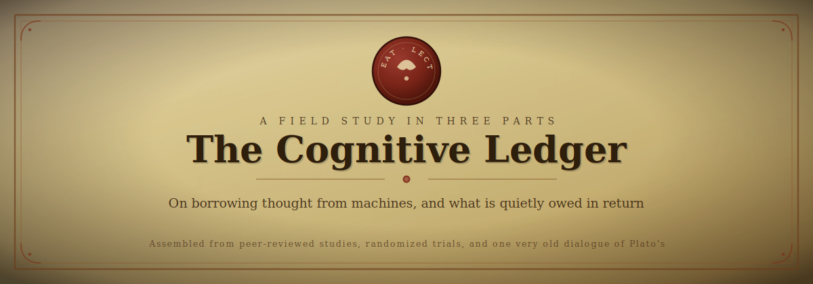
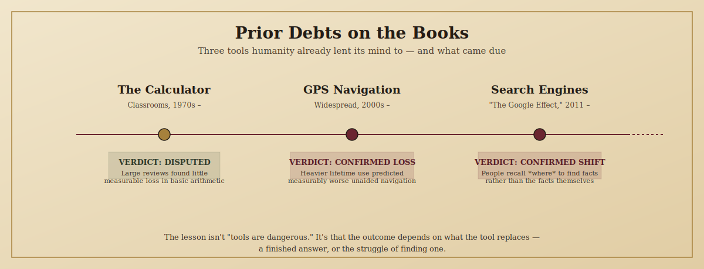
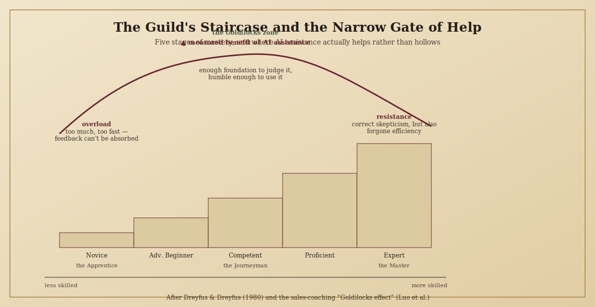
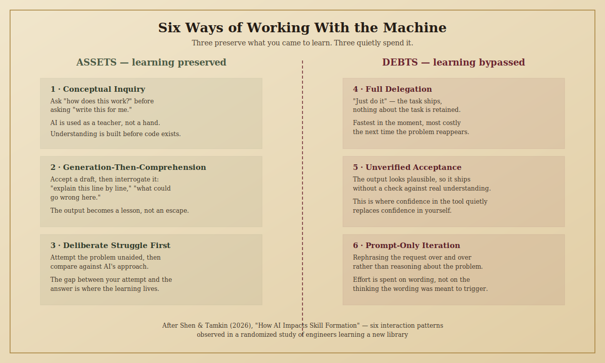

 

> *In Plato's Phaedrus, the god Theuth offers the gift of writing to King Thamus, promising it will make people wiser. Thamus refuses the compliment: those who learn to write, he warns, will stop exercising memory, trusting instead in marks made by another hand — they will seem wise without being wise.*
>
> *Thamus was half right. Writing did erode a certain kind of memory. He was wrong that this made it worth refusing. The real question was never whether to use the tool — it was which parts of the mind to hand over, and which to keep.*

 

## What This Ledger Is

Every tool that thinks for you leaves an entry in two columns. One column is what you gained back — time, ease, output. The other is what you quietly stopped practicing. Most of the time nobody reads the second column until the balance is already due.

This repository is a plain-language audit of that second column, built entirely from peer-reviewed studies, randomized trials, and pre-registered research published between 2011 and 2026 — not from anecdote or techno-panic. Where the evidence is strong, it says so. Where it's thin, contested, or still a preprint, it says that too.

It follows three people through the same questions, because the answer to "does AI hurt your thinking" depends enormously on who is asking:

| | **The Apprentice** | **The Journeyman** | **The Master** |
|---|---|---|---|
| Real-world equivalent | A student, still learning a subject | A junior professional, early in a career | A senior practitioner, years of built expertise |
| The real risk | Never building the skill at all | Building a shallow version of it | Assuming expertise makes you immune |

You'll meet all three again throughout this document.

 

## Table of Contents

1. [Old Debts — What History Already Taught Us](#i-old-debts--what-history-already-taught-us)
2. [The Mechanics of the Mind — Why Skills Actually Fade](#ii-the-mechanics-of-the-mind--why-skills-actually-fade)
3. [The Debts Named Precisely — What the Research Actually Found](#iii-the-debts-named-precisely--what-the-research-actually-found)
4. [How the Debt Shows Up — Three People, Three Mornings](#iv-how-the-debt-shows-up--three-people-three-mornings)
5. [The Guild's Staircase — Why Skill Level Changes Everything](#v-the-guilds-staircase--why-skill-level-changes-everything)
6. [Can a Master Lose the Craft?](#vi-can-a-master-lose-the-craft)
7. [Balancing the Ledger — What Actually Works](#vii-balancing-the-ledger--what-actually-works)
8. [The Personal Audit](#viii-the-personal-audit)
9. [Full Bibliography](#ix-full-bibliography)

 

---

## I. Old Debts — What History Already Taught Us

AI didn't invent the idea of thinking less because a tool thinks for you. There's a real research trail on this, and it splits in a way that turns out to matter a great deal.

**The calculator — a genuinely disputed case.**
Multiple large classroom studies, going back decades, compared students who used calculators freely against students who didn't, and largely found *no significant difference* in basic arithmetic ability. This surprises people, and it's worth sitting with: it means offloading a task to a tool doesn't automatically cost you the underlying skill. The likely explanation is that arithmetic kept being *taught and tested* by hand regardless of what tool existed at home — the skill was still being deliberately practiced, so it didn't erode.

**GPS navigation — a real, measured loss.**
A study out of University College London recruited 50 regular drivers, measured how much lifetime GPS experience each person had, then tested everyone on wayfinding tasks *with GPS taken away*. People with heavier lifetime GPS use performed measurably worse at building a mental map of unfamiliar space. A follow-up a few years later, retesting a smaller group, suggested the relationship runs in the direction of GPS causing the decline, not the reverse. The mechanism has a name and a location: the hippocampus, the brain region responsible for spatial memory, is used less when a device is doing the wayfinding, and it's a "use it or lose it" structure.

**Search engines — the original "Google Effect."**
A 2011 study by Sparrow and colleagues found something specific: heavy search-engine users didn't necessarily remember *less* information overall, but they shifted what they remembered — toward remembering *where* to find a fact rather than the fact itself. This is arguably the most important precedent for understanding AI, because it shows offloading doesn't erase memory outright; it restructures what gets stored.

**So what actually determined the difference?**
Look at the three cases side by side. The calculator replaced a *mechanical, well-drilled, still-separately-practiced* skill. GPS and search replaced something with no separate practice loop — once the tool existed, nobody made you rebuild a mental map or hold a fact in memory anyway. That's the pattern worth carrying into every later section of this document: **the danger isn't offloading a task. It's offloading a task with nothing left in place to keep the underlying skill alive.**

 

---

## II. The Mechanics of the Mind — Why Skills Actually Fade

Before naming the specific problems AI creates, it's worth understanding — in plain terms — *why* a skill would fade from disuse at all. Four ideas do almost all of the explanatory work here, and each has a real origin outside of AI research.

**1. Use it or lose it (neuroplasticity)**
The brain reallocates resources away from circuits it doesn't use. This isn't a metaphor — it's a well-established property of how neural connections strengthen with repeated use and weaken without it. It's the same underlying reason physical skills fade without practice, and it applies to mental ones too.

**2. Desirable difficulty**
Cognitive psychologist Robert Bjork coined this term to describe something counterintuitive: making a learning task *slightly harder* — forcing retrieval from memory instead of handing over the answer — produces stronger, longer-lasting learning than making it easy. An answer that arrives instantly, with no struggle, tends to be forgotten faster than one you had to work for. This is the mechanism behind why an AI that hands over a finished answer can quietly cost you the very retention you were trying to achieve.

**3. Automation bias and complacency**
Long before generative AI, aviation researchers documented that pilots using autopilot systems became less vigilant monitors of the aircraft — not because they were careless people, but because trusting an automated system is, itself, a cognitive habit that reduces active checking. Automation bias is the tendency to accept an automated system's output without adequately verifying it; automation-induced complacency is the reduced vigilance that comes from constant reliable performance. Neither requires malice or laziness — they're a predictable response to a tool that's right often enough.

**4. Metacognitive laziness**
"Metacognition" means thinking about your own thinking — noticing when you don't understand something, checking your own reasoning, planning your next step. Recent education research has documented a specific failure mode with AI tools: learners stop running that internal check altogether, because the tool appears to have already done the checking for them. The problem isn't that the learner got a wrong answer — it's that the *habit of asking whether it's right* stops firing.

Put together, these four ideas explain almost every "form" of the problem described in the rest of this document: skills fade from disuse, easy answers are remembered less than hard-won ones, trust in a tool reduces vigilance toward it, and the habit of checking your own thinking can go quiet without you noticing.

 

---

## III. The Debts Named Precisely — What the Research Actually Found

Each entry below states **what the study actually did**, not just its conclusion — because *how* a finding was produced determines how much weight it can bear.

### Debt 1 — Critical Thinking Decline
**Study:** Gerlich (2025), published in *Societies*.
**How it was done:** 666 participants across a range of ages and education levels completed a survey and a subset were interviewed in depth. Researchers measured self-reported AI usage frequency and reliance, alongside a standardized measure of critical thinking.
**What it found:** Heavier AI use correlated with lower critical thinking performance, and this relationship was explained in large part by cognitive offloading — i.e., offloading wasn't just a side effect, it was the mechanism connecting AI use to the decline. Younger participants were more affected; more education acted as a partial buffer.
**Why it matters here, and its real limit:** This is the largest, most-cited study in the field, but it's a survey — it shows a strong association, not proof that AI *caused* the decline in any individual. People who already think less critically may simply be more drawn to leaning on AI. Treat this as evidence the pattern is widespread, not as proof of direct causation.

### Debt 2 — Cognitive Debt (the "doesn't bounce back" finding)
**Study:** Kosmyna et al. (2025), MIT Media Lab — "Your Brain on ChatGPT" (currently a preprint, not yet peer-reviewed).
**How it was done:** 54 participants were split into three groups — writing essays using ChatGPT, using a search engine, or using no tool at all — across three sessions, while researchers recorded brain activity with EEG. In a fourth session, some participants swapped groups: former ChatGPT users had to write unaided, and former unaided writers were given ChatGPT.
**What it found:** The ChatGPT group showed the weakest neural connectivity, remembered less of their own writing, and felt less ownership over it. The genuinely striking part is the swap: when ChatGPT users had to write without the tool, their brain engagement did not simply recover to baseline — the effect lingered. That lingering cost is what the researchers named "cognitive debt."
**Why it matters, and its real limit:** This is the strongest evidence that offloading can leave a residue *after* the tool is removed, not just reduce performance while it's in use. But it's still a preprint with 54 participants, tested one task (essay writing) with one model (2025-era ChatGPT) — don't generalize this specific number or magnitude to all AI use or all tasks.

### Debt 3 — Confidence Miscalibration
**Study:** Lee et al. (2025), Microsoft Research and Carnegie Mellon University, presented at CHI 2025.
**How it was done:** 319 working professionals who used generative AI at least weekly were surveyed and asked to describe specific, real instances of using AI at work — 936 examples in total — and to reflect on how much critical thinking each instance involved.
**What it found:** The more confidence someone had *in the AI tool itself*, the less critical thinking they applied to its output. The more confidence someone had *in their own ability*, the more critical thinking they applied — even though it felt more effortful to them. Critical thinking wasn't vanishing so much as changing shape: workers described shifting effort from generating ideas to verifying and integrating AI's output.
**Why it matters:** This is the best available evidence for the actual *mechanism* behind selective overreliance — it isn't that AI use is uniformly bad, it's that trusting the tool more than yourself is the specific thing that switches off scrutiny.

### Debt 4 — Skill Formation Gap (the developer-specific evidence)
**Study:** Shen & Tamkin (2026), Anthropic — "How AI Impacts Skill Formation."
**How it was done:** A randomized controlled trial. 52 professional or freelance developers were assigned to learn a genuinely new Python library (Trio) either with or without AI assistance, then tested afterward on comprehension, code reading, and debugging.
**What it found:** The AI-assisted group scored roughly 17 percentage points lower on the follow-up quiz — close to two letter grades — with the largest gap in debugging specifically. The AI group was not meaningfully faster overall; some participants spent up to a third of their time simply composing prompts. The researchers also identified six distinct ways people interacted with the AI during the task — three that preserved learning, three that bypassed it (detailed in Part VII).
**Why it matters:** This is the strongest study in the entire bibliography for a technical audience, because it's a randomized experiment with an objective outcome measure, not a survey — and it isolates the exact mechanism your audience is most likely to encounter: fluent, working code that nobody had to understand to produce.

 

---

## IV. How the Debt Shows Up — Three People, Three Mornings

**The Apprentice** is studying for an exam and asks the AI to explain a concept she doesn't understand. It gives a clean, correct explanation. She copies the explanation into her notes, feels like she understands it, and moves on — she never restates it in her own words, never tests whether she could reconstruct it without the notes. Three weeks later, on the exam, she recognizes the explanation but can't reproduce the reasoning behind it. This is desirable difficulty in reverse: the answer arrived too easily to leave a trace.

**The Journeyman** is two months into a new job, given a task in a codebase he doesn't know well. He asks the AI to write the function. It works on the first try. He ships it, and files the pattern away as "done." Weeks later, a related bug appears in production, in code that looks almost identical, and he has no idea where to start — he never built the mental model of *why* the first piece of code worked, only that it did. This mirrors the Anthropic finding almost exactly: the comprehension gap only shows up later, when something breaks.

**The Master** has fifteen years of experience and treats the AI as a fast typist for decisions she's already made. Most days this works — her judgment is the bottleneck the AI can't replace, and she genuinely gets faster. But on a rushed Friday, in an area slightly outside her core expertise, she accepts a plausible-looking suggestion without her usual scrutiny, because the tool has been reliable all week. This is automation-induced complacency, and it's the one failure mode that experience doesn't automatically protect against — addressed directly in the next section.

 

---

## V. The Guild's Staircase — Why Skill Level Changes Everything

Skill acquisition research (Dreyfus & Dreyfus, 1980) describes five stages from novice to expert, each defined by how much a person relies on explicit rules versus internalized judgment. Recent research on AI assistance maps onto this staircase in a specific, testable way.

**Study — the "Goldilocks effect" in AI-assisted coaching (Luo et al.).**
Researchers introduced AI-generated coaching feedback to sales teams of varying experience levels and measured subsequent performance.
**What they found:** Novices, given fast and complex AI feedback, were overloaded — performance actually *dropped*, because they lacked the foundation to make sense of what the tool was telling them. Experts largely ignored the tool, partly out of distrust and partly because it threatened their sense of professional identity — leaving performance flat. **Mid-level performers improved the most** — they had enough foundation to understand the feedback, and enough humility to actually use it.

**Study — does AI-assisted practice actually stick? (Lira et al., 2025, University of Pennsylvania).**
Participants practiced writing cover letters, one group with AI-generated examples to learn from, the other unaided. Researchers then removed the AI entirely and retested everyone a day later.
**What they found:** The AI-assisted group kept their advantage — the gains were still measurable a day later, with the AI no longer available. This is an important counterweight to the MIT and Anthropic findings above: AI-supported learning *can* produce durable skill, and the deciding factor was less about the technology and more about how the practice was structured — participants were shown examples to learn from, not simply handed a finished product to submit.

**What this means practically:** There is no single answer to "does AI help or hurt learning." The honest answer is: it depends on where you are on the staircase, and on whether the interaction requires you to do the work of understanding or lets you skip it. The middle of the staircase is where AI assistance has shown the clearest benefit — enough foundation to evaluate it, not yet so much expertise that oversight goes on autopilot.

 

---

## VI. Can a Master Lose the Craft?

This is a different question from "can a beginner fail to build a skill" — it's whether someone who already has a skill can lose it through reliance on AI.

The direct evidence here is thinner than for novices, largely because most rigorous studies (Anthropic's included) were specifically designed around *learning something new*, not maintaining something already mastered. What the surrounding research suggests, pieced together honestly:

- **Existing expertise appears to function as a buffer, not a vaccine.** In the Microsoft/CMU study (Debt 3), the professionals who kept applying critical thinking were the ones with high confidence in their *own* ability — expertise didn't automatically protect against overreliance; the deciding factor was whether that expertise translated into active scrutiny of the tool's output, rather than the mere fact of having it.
- **The mechanism that would cause decay in an expert is automation-induced complacency (Part II), not skill-formation failure.** An expert isn't at risk of *failing to learn* debugging — she already knows it. She's at risk of practicing it less often, in a domain where "practice" mostly means the low-stakes, everyday reps that keep judgment sharp. Whether that specific erosion happens to genuine experts, and how much, over what timeframe, is not yet directly measured in the literature as of this writing — it is a reasonable extrapolation from the mechanism, not a separately confirmed finding.
- **Domain research (Khan, 2025)** contrasting students who tried to outsource learning entirely against cybersecurity professionals who used AI to augment already-strong domain expertise found the professionals' outcomes held up, provided AI use amplified their judgment rather than replaced it — supporting the idea that *how* an expert uses the tool matters more than the mere fact of using it.

**The honest verdict:** expertise almost certainly slows decay and raises the bar for how much reliance is safe — but "I'm already good at this" is not evidence of immunity, it's evidence you haven't tested the assumption recently. The Master in Part IV lost her footing not because she lacked skill, but because a good week made her stop checking.

 

---

## VII. Balancing the Ledger — What Actually Works

This section is graded honestly: some of what follows is directly measured, some is a reasonable inference, and that distinction is marked every time.

**Directly measured (Shen & Tamkin, 2026):**
The Anthropic study didn't just measure whether people used AI — it identified *how* they used it, in six recognizable patterns, three of which preserved learning outcomes and three of which didn't (see diagram above). The practical takeaway drawn directly from their data: ask "how does this work" before "do this for me," interrogate a generated answer afterward rather than accepting it, and attempt a problem yourself before comparing your attempt to the AI's.

**Reasonably well-supported by adjacent research:**
- **Socratic-style AI interaction** — several studies (including a randomized trial in K–12 science classrooms) found that AI tutors designed to ask guiding questions, rather than hand over answers, produced measurably better critical-thinking and reasoning outcomes than plain answer-giving tools. This directly supports building "explain your reasoning" or "ask me a question first" into how you prompt.
- **Treating AI as a collaborator you scrutinize, rather than an oracle you accept** — recent research (Wang & Zhang, 2026) found that this framing alone changed behavior: people who mentally treated the AI as a collaborator became simultaneously more critical of its output *and* more willing to delegate strategically, while people who treated it as a passive tool did neither.

**Plausible, but not yet directly tested — flagged honestly rather than passed off as proven:**
- A dedicated "AI-free" block of deep work restoring or protecting a skill over time. This is a reasonable extension of "use it or lose it," but no study in this bibliography measured it directly. Treat it as a sensible practice, not a proven intervention.
- Journaling or reflecting on your AI use afterward. Plausible given what's known about metacognition generally, but not something the studies above tested directly.

 

---

## VIII. The Personal Audit

These are reflection prompts, not a validated psychological instrument — there is no scored test here, and nothing below should be read as a diagnosis of anything. Use them the way you'd use a ledger: an honest, private accounting, revisited occasionally.

**For the Apprentice (still building a skill):**
- After using AI to understand something, could you re-explain it right now, closed-book, in your own words?
- Did you struggle with this at all before asking, or did you go straight to the tool?

**For the Journeyman (early in applying a skill):**
- When the AI's answer worked, do you know *why* it worked — could you have predicted the failure mode if it hadn't?
- If this exact tool were unavailable tomorrow, could you still complete today's task, more slowly but correctly?

**For the Master (already skilled):**
- In the last week, was there a moment you accepted an AI suggestion faster than you would have a colleague's, purely because it had been reliable lately?
- When did you last deliberately do this task the slow way, just to check your own edge hasn't dulled?

 

---

## IX. Full Bibliography

- Bjork, R. A. — foundational work on *desirable difficulties* in learning.
- Clark, A., & Chalmers, D. (1998). *The Extended Mind.* Analysis, 58(1).
- Dreyfus, S. E., & Dreyfus, H. L. (1980). *A Five-Stage Model of the Mental Activities Involved in Directed Skill Acquisition.*
- Gerlich, M. (2025). *AI Tools in Society: Impacts on Cognitive Offloading and the Future of Critical Thinking.* Societies, 15(1), 6.
- Khan, K. (2025). *Automated but Atrophied? Student Over-Reliance vs Expert Augmentation of AI in Learning and Cybersecurity.*
- Kosmyna, N., et al. (2025). *Your Brain on ChatGPT: Accumulation of Cognitive Debt when Using an AI Assistant for Essay Writing Task.* MIT Media Lab (preprint).
- Lee, H. H., et al. (2025). *The Impact of Generative AI on Critical Thinking: Self-Reported Reductions in Cognitive Effort and Confidence Effects From a Survey of Knowledge Workers.* CHI 2025 / Microsoft Research.
- Lira, B., et al. (2025). University of Pennsylvania study on durability of AI-assisted skill practice in a writing task.
- Luo, X., et al. Sales-coaching study documenting the "Goldilocks effect" of AI feedback across experience levels.
- Plato. *Phaedrus* — the myth of Theuth and Thamus (paraphrased above, not quoted).
- Shen, J. H., & Tamkin, A. (2026). *How AI Impacts Skill Formation.* Anthropic.
- Sparrow, B., Liu, J., & Wegner, D. M. (2011). *Google Effects on Memory: Cognitive Consequences of Having Information at Our Fingertips.* Science.
- Aviation automation literature on automation bias and complacency (Casner et al., 2014; Ebbatson et al., 2010), as synthesized in Joyner et al. (2024).
- Meuwese, R. et al. / UCL study on habitual GPS use and spatial memory, *Scientific Reports* (2020).

*This is a living ledger. Corrections, stronger citations, and disagreements are welcome via issues and pull requests — an audit that can't be challenged isn't much of an audit.*

 

Compiled July 2026. Evidence in this field is moving quickly — treat every finding above as current as of that date, not as settled for all time.

